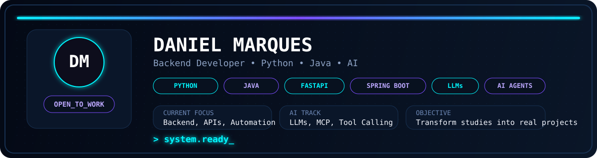

  

---

### Contribution Arcade

<picture>
  <source media="(prefers-color-scheme: dark)" srcset="https://raw.githubusercontent.com/marquessdann/marquessdann/output/pacman-contribution-graph-dark.svg">
  <source media="(prefers-color-scheme: light)" srcset="https://raw.githubusercontent.com/marquessdann/marquessdann/output/pacman-contribution-graph.svg">
  
</picture>

---

### Tech Stack

---

### AI / LLMs / Automation

---

### GitHub Stats

---

### Contact

